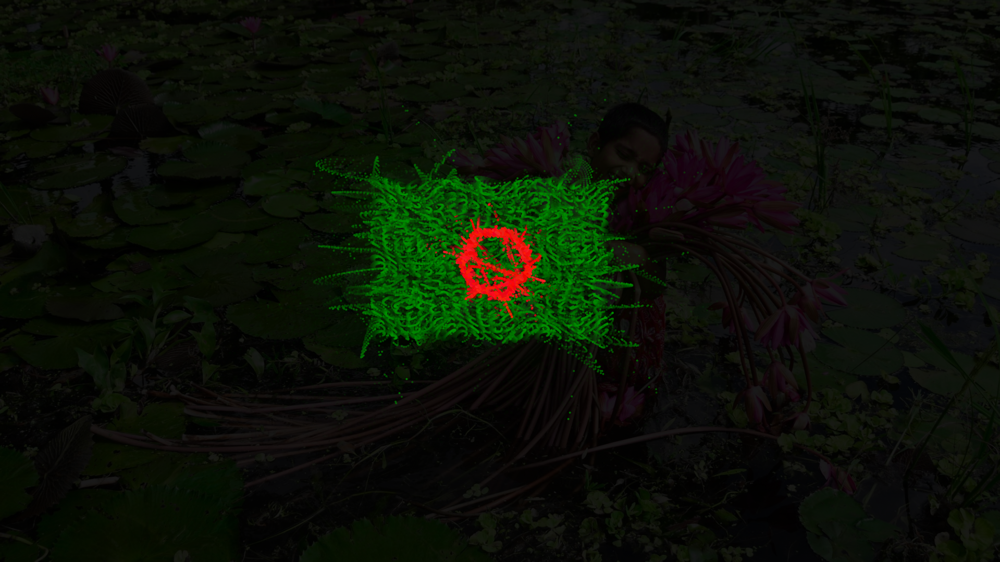

  <h1>BANGLADESH FLAG ANIMATION</h1>
  

## ABOUT

I’ve been experimenting with Creative Coding lately, and what better way to practice than animating our national flag? Using vanilla JavaScript and the Canvas API, I implemented spring based physics and trigonometric waves to create this interactive experience.

<!-- ## Demo
 -->

  
  

## KEY CONCEPTS

* Custom Vector Math
* Spring Mass Physics
* Trigonometric Waves

